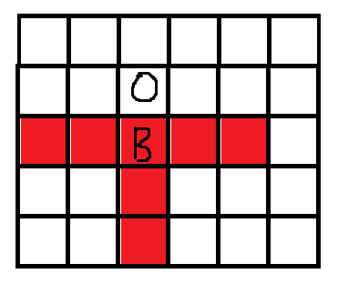

# Crystal Warfare
India and Pakistan are at war and are out to make weapons of mass destruction. There is one piece of technology which could turn the tide of the war for the country with access to it - Chalcorite crystals.

You are a soldier of the Indian army and your task is to scout a Chalcorite-rich area and collect as many crystals as possible. But there's a catch - Pakistan has sent their own soldier too. 

## Goal
You and your opponent both have $5$ hitpoints. The one who collects the greater number of crystals will be able to help their country make the more powerful weapon. Or the player who eliminates the other player by reducing their hitpoints to 0 first immediately wins as they now have unimpeded control over the whole area.

## Rules
The game is played on a square grid of side length `gridSize` = $20$ units.  
Each player starts in a randomised position on different halves of the board.

There are **crystals** scattered across the grid and also **obstacles**.  
### Grid layout:   
* Each cell is either a crystal, an obstacle or empty. Crystal is indicated by **C**, obstacle by **#** and empty cell by **.** (dot).
* Crystals and obstacles are placed randomly on the grid. There are guaranteed to be at least $10$ crystals on the map and the number of crystals is always **odd**.
* Players can only occupy empty cells and it possible for both players to be on the same cell simultaneously.

### Player mechanics:  
This is a turn based game and at the start of each turn you will recieve the game state from the game engine. You will also receive information about your opponent's moves at the beginning of each turn indicating which direction they moved in (if they moved).  
Details on the moves you may make are as follows:

* On each turn, a player may do one or more of the following actions: **`MOVE`, `BOMB`, `ATTACK`**, provided the necessary conditions (explained ahead) are satisfied.

* Players may move 1 cell horizontally or vertically by using the **`MOVE`** command followed by **`LEFT`, `RIGHT`, `UP`** or **`DOWN`**. Players cannot attempt to move into a cell containing a crystal or obstacle.

* As both players are wearing specially designed invisibility suits they cannot see each other's position, even if they are on the same cell.

* Using the **`BOMB`** followed by map coordinates `x`, `y` players may place a bomb on an **empty cell** within a 3-cell range of their position, i.e, the **manhattan distance** between the target cell and their current position is $\leq 3$. There is a $4$ turn cooldown before a player may use the command again, i.e, it can be used on the $5^{th}$  turn after the current one.   
**Manhattan distance** between two cells is calculated as follows:  
$|x_1 - x_2| + |y_1 - y_2|$  
where the coordinates of the cells are $(x_1, y_1)$ and $(x_2, y_2)$.   
* Bombs are used to destroy crystals. Before the next turn the bomb will explode, affecting the target cell and two cells adjacent to it horizontally and vertically.  
  
For example, in the above image, the bomb was placed at '**B**' and '**O**' denotes an obstacle. The explosion cannot pass through **obstacles**. All the affected cells are marked red.  
* If a crystal is present among the affected cells then it will be acquired by the player who placed the bomb and on the next turn the crystal will be gone, leaving an empty cell in its place.  
If the crystal was in the affected range of **both players** simultaneously then the crystal will be gone but neither player will get it.  
The bombs being weak and designed to only harvest crystals, will not affect either of the players.

* Using the **`ATTACK`** command followed by map coordinates `x`, `y` a player may attack with a lethal bomb in a 3-cell range. This command works in exactly the same way as the **`BOMB`** command except it does not affect **crystals** and instead it deals $1$ $HP$ of damage to the opponent if they are on one of the affected cells. This also has a cooldown of $4$ turns.

## Win/Lose Conditions
One of the following situations may arise:
* A player provides an output string that does not follow the mentioned format, attempts to make a move disallowed by the rules or does not send the input within the time limit (1 second). Then, that player **immediately loses**. If this happens to both players on the same turn then it is a **tie**.

* The $HP$ of one of the players **dropped to $0$**. Then the other player automatically wins regardless of the number of crystals they possess. However, if both players' $HP$ drops to $0$ on the same turn then it is a **tie** regardless of the number of crystals possessed.

* All the crystals in the area are gone (either collected or destroyed). In this case the player with the **greater number of crystals** wins. If both players have the same number of crystals, the player with the **higher HP** remaining wins. If both players have the same **HP** it is a tie.

* 100 turns have passed. In this case again the player with the **greater number of crystals** wins. If both players have the same number of crystals, the player with the **higher HP** remaining wins. If both players have the same $HP$ it is a **tie**.


## Game Input
* If it is the first turn then skip this point and move to the rest.  
If it is not the first turn, then the first line will be your opponent's movement. It will be in the format `MOVE <direction>` (E.g `MOVE UP`).   
* The next line contains $8$ space separated integers in the format `x y bombCooldown attackCooldown yourCrystals enemyCrystals yourHP enemyHP`  
where,  
`x`, `y` are your coordinates. The top left corner is $(0, 0)$, the $x$ coordinate increases from left to right and $y$ coordinate increases from top to bottom.  
`bombCooldown` is the number of turns left before you can use the **`BOMB`** command.  
`attackCooldown` is the number of turns left before you can use the **`ATTACK`** command.  
[**Note**: You can use the above two commands on a turn if and only if the cooldown you received in the game input for that turn was $0$.]
`yourCrystals` is the number of crystals you possess.  
`enemyCrystals` is the number of crystals your enemy possesses.  
`yourHP` is the number of remaining hitpoints you have.
`yourHP` is the number of remaining hitpoints you have.  
`enemyHP` is the number of remaining hitpoints your opponent has.  

    E.g `3 2 4 4 5 3`

* The next `gridSize` lines will each contain a string of `gridSize` characters. This represents the grid on the current turn.
    * `.` (dot) represents an empty cell (this cell may contain a player but that will not be disclosed).
    * `C` represents a crystal.
    * `#` represents an obstacle.

An example for a smaller `gridSize` of 4 units could be as follows:
```
..C.
.#.C
....
#.C.
```
But note that the actual `gridSize` for the game is larger (as specified in the beginning).
## Output Format
On each turn both players must provide a single line of output specifying their move in the following format:  
`MOVE <direction> BOMB <x> <y> ATTACK <x> <y>` followed by a newline character.  

* **Terminating with a newline character** is necessary and very important to signal to the engine the end of your input.

* Make sure to **flush your output** to **stdout**. In C++ this can be done with: `fflush(stdout)` or to enter a newline character while simultaneously flushing the output send `std::endl` into `std::cout`.

* You must send your output within **$1$ second** of receiving input from the engine. Failing to do so will result in an immediate loss. Note that failing to flush your output or failing to send a newline character to terminate your output may also lead to this.

* `<direction>` must be one of the following strings: `UP`, `DOWN`, `LEFT`, `RIGHT`.  
* The `<x>` and `<y>` following `BOMB` are the coordinates of the cell you wish to bomb. If you cannot or do not wish to bomb any square then both of these integers must equal `-1`.
* Similarly for the `<x>` and `<y>` following `ATTACK`.

E.g `MOVE DOWN BOMB -1 -1 ATTACK 11 13`

If a player:  
* attempts to **`BOMB`** OR **`ATTACK`** when the cooldown is still non-negative or on a square that is not in the allowed range, 
* Ouputs `x` and `y` coordinates that are outside the grid and neither are they both equal to `-1`, or
* Provides any output that does not conform to the specified format,  
then they immediately lose/tie as per the rule mentioned in the **Win/Lose Conditions** section.